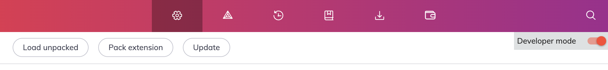
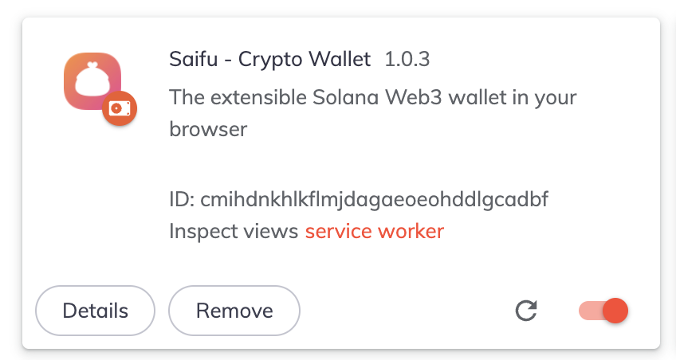

# How to install non-webstore versions of Saifu
1. Download the latest non-webstore [chrome release](https://github.com/saifuwallet/saifu-releases/releases)
2. Navigate to your browsers extension settings and enable 'Developer mode' in the top right corner

3. Click 'Load unpacked' 
4. Navigate to the unpacked folder containing the Saifu dev version

If all worked fine, Saifu should load successfully

