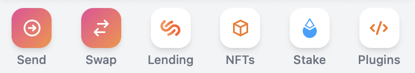
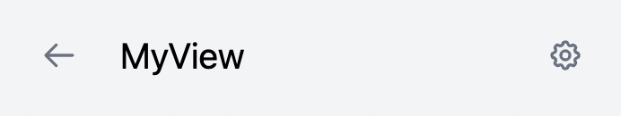

# Plugin Overview

---
- [How to write plugins for Saifu](How%20to%20write%20plugins%20for%20Saifu.md)
- [How to load external plugins for development](How%20to%20load%20external%20plugins%20for%20development.md)
---

Plugins are loaded into Saifu using the [SystemJS](https://github.com/systemjs/systemjs) dynamic ES loader and built using [saifu-api](https://github.com/saifuwallet/saifu-api)

## Plugin lifecycle
1. On Saifu start, the plugin loader is collecting all available plugins injects runtime information such as hooks using SystemJS
2. Plugin constructor() is being called to create an instance. No custom code is to be run at this phase
3. If the plugin is in enabled state, `async onload()` will get called, this is where you initialize your plugin and start preparing data
4. After the onload phase, all `Views[]` of all plugins that were registered during `onload()` are getting collected and routes generates
5. At this point initialization is complete and further action happen when
    1. The user opens a view
    2. Your plugins hooks and integrations are being used 

## What plugins can do
- Provide additional additional screens in the form of apps
- Store/load persistent state into Saifu
- Utilize react hooks to get information about the users wallet state (token accounts, publicKey, connection, etc.)
- Pass transactions to the main wallet for signing and confirming 
- Subscribe to wallet events to act when something happens (coming soon)
- Provide additional data such as token balances and annotations to the wallet (coming soon)
- Integrate middlewares with components such as address book to provide rich data (coming soon)

## How plugins are built
Plugins can be build with any bundler, as long as it generates valid SystemJS packages (`System.register(...)`. We are using [rollup.js](https://rollupjs.org/guide/en/)

**Important:** Treat the following dependencies as external, meaning you want SystemJS to provide those for you during runtime. In rollup you can do this by adding them to the `externals` configuration field. **Don't include them in your build**! 

- `saifu`
- `react`
- `react-dom`
- `@babel/runtime/helpers/interopRequireDefault`

## Architecture Overview

The plugin API can be found in the saifu-api repository: https://github.com/saifuwallet/saifu-api

### Plugin class
Plugins are implemented using normal JavaScript classes, extending the abstract `Plugin` class ([here](https://github.com/saifuwallet/saifu-api/blob/master/saifu.d.ts#L165=)) and implementing notably `onload`

During onload, Plugins can register event hooks, middlewares and views with the wallet to provide integrations. Logic for setting everything up, fetching initial data and loading plugin state should happen here

### Views
Views are these small app icons you see on the dashboard of Saifu:


They are registered during `onload()` using `this.addView(View)`: 
```ts
    this.addView({
      title: 'MyView',
      id: 'myview',
      component: <MyView color={this.settings.color} />,
      icon: <CubeIcon />,
    });
```

Views are implemented in as standard React functional components and support everything that React components can do

#### View hooks
The [saifu-api](https://github.com/saifuwallet/saifu-api) provides a handful of custom hooks to subscribe and integrate wallet data such as tokens, publicKey or price information into your plugin. As this list is constantly changing and gets expanded with new hooks, make sure to check the code available at https://github.com/saifuwallet/saifu-api/blob/master/saifu.d.ts#L10=

React hooks provide deep integration into Saifu and benefit from automatic component re-renders when the hook changes. For more information on hooks, please read [Introducing Hooks](https://reactjs.org/docs/hooks-intro.html).

#### Special case: useMutation, useQuery

For people familiar with [React Query](https://react-query.tanstack.com/), please import `useMutation` and `useQuery` from the saifu-api if you wish to use it, don't directly bundle it

### Plugin storage
Plugins are able to persists simple data into plugin storage using `loadData()` and `saveData()` methods, usually called during `onload()`. This allows plugins to persist configuration options such as API keys or UI tweaks

### Settings
In relation to plugin storage, plugins are also able to provide a settings screen users can use to directly change parameters of your plugin. 

If your plugin defines a settings object, it will show up automatically in the form of a gear icon at the top of the screen


To add settings, use `setSettings()` during `onload()`, pointing to a subclass of abstract `PluginSettings` ([here](https://github.com/saifuwallet/saifu-api/blob/master/saifu.d.ts#L136=))

```ts
this.setSettings(new MySettings(this));
```

The settings class itself has to implement a `display()` method that returns a list of settings objects that describe the shape of the Settings UI

```ts
display() {
const setting = new Setting()
  .setName('Main Settings')
  .setDesc('Please enter your favorite color')

  // add a textbox
  .addText((text) => {
    return text
      .setPlaceholder('placeholder')
      .setValue(this.plugin.settings.color)
      .onChange(async (val) => {
        this.plugin.settings.color = val;
        await this.plugin.saveSettings();
      });
  });

  return [setting];
}
```

### Coming soon: Middleware
🚧 Under construction 🚧

### Coming soon: Event hooks
🚧 Under construction 🚧
